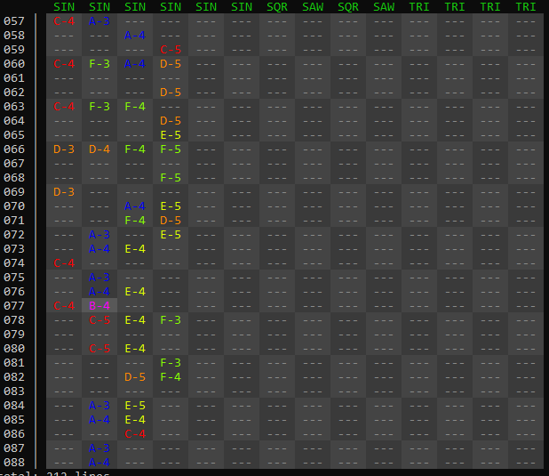

# Sybeth Music Console Program

## Disclaimer
Heavily in development, files might not be compatible in th future

## How to use
- start with `cargo build`/`cargo run`
- file gets saved to `autosave.syb`  
-> delete that file for fresh start
- instruments: 
    currently only primitive waves with manual volume setting
  - SIN -> sine wave
  - SQR -> square wave
  - SAW -> saw wave
  - TRI -> triangle wave
  

## Key binds
- arrow, top/bottom, left/right -> move
- space -> start/stop replay
- A-G -> place notes
- Q -> delete note
- 0-9 -> set octave (default 4)
- \# -> toggle sharp version of note
- +/- insert/delete row
- I/K -> swap rows up/down
- . -> toggle short note (3/4) 
- esc -> exit and save to auto_save.syb
- m -> start recording macro, stop with m again
- , -> run macro
- P -> export to `export.wav` 